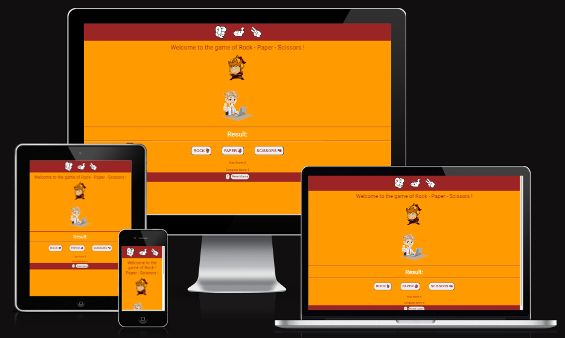
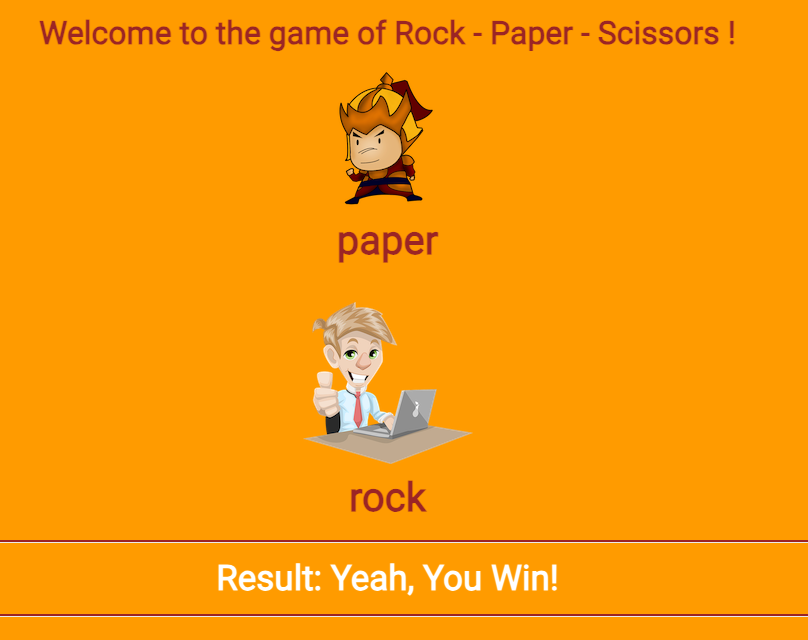
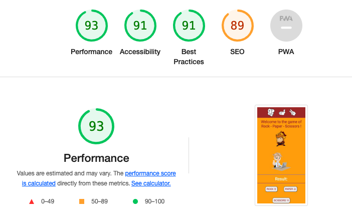

# Rock - Paper - Scissors

## Introduction

[To the Game](https://mscrieky.github.io/Rock-Paper-Scissors/)

Overview:

Welcome to the classic game of Rock - Paper - Scissors! This simple and timeless game allows you to test your luck and strategy against the computer. The rules are straightforward, making it a perfect choice for quick and enjoyable gaming sessions.

How to Play:

- Choices: You have three options: rock, paper, or scissors.</li>
- Computer's Choice: The computer will randomly select its choice.</li>
- Winning Rules: Paper beats Rock, Rock beats Scissors, and Scissors beats Paper.</li>
- Outcome: After making your choice, the result will be displayed. Will you win, lose, or draw?</li>
- Play Again: Enjoy endless rounds! You can play as many times as you want to refine your skills.</li>
- Reset: To start over, simply click the reset button to reset the scores back to zero.</li>

Game Features:

- Visual Guide: At the top of the page, a visual guide demonstrates how to form your hands for the game. This adds a helpful and interactive element to your gameplay experience.</li>
- Portability: The beauty of this game lies in its simplicity. Whether you're waiting in a queue or taking a break, you can play anytime, anywhere. All you need is another player and your hands!</li>
- Endless Fun: Challenge yourself to multiple rounds and see if you can outsmart the computer consistently.</li>
- User-Friendly Interface: The game's layout is designed for ease of use, ensuring a smooth and enjoyable gaming experience.</li>

How to Run the Game:

To play the game, simply open the webpage and start making your choices. The computer's moves are generated randomly, creating an element of surprise in every round.

Enjoy the Game:

Rock - Paper - Scissors is not just a game; it's a timeless companion for moments when you need entertainment on the go. Embrace the simplicity, challenge yourself, and most importantly, have fun!

## Features

Welcome Message: Upon entering the game, players are greeted with a warm welcome message. Above the message, there is an illustrative image displaying the classic hand combinations used in the game, enhancing the game's visual appeal.

Player and Computer Representation: In the center of the page, there are two visually appealing images - one representing the player and the other representing the computer. These images add a graphical element to the gameplay, making it more engaging.

Result Area: After making a selection, a dynamic result area displays the outcome of the game. Each time the player clicks on their chosen button, a corresponding message appears, indicating whether the player has won, lost, or if it's a draw.

Player's Selection Buttons: Below the result area, there are three interactive buttons. These buttons allow the player to make their selection by choosing from the classic options: rock, paper, or scissors. The buttons are designed for easy navigation and selection, enhancing the user experience.

Score Tracking: Under the player's selection buttons, the scores are prominently displayed. There are separate score counters for the player and the computer, providing real-time feedback on their performance. This feature adds a competitive edge to the game, motivating players to improve their skills.

Footer: In the footer section, there are two essential elements. First, there is a "?" button, representing the rules of the game. When clicked, an alert message pops up, providing clear and concise instructions on how to play the game. Additionally, there is a reset button that allows players to reset the game to its original state, providing a seamless way to start afresh.

Denna design ger en professionell och användarvänlig upplevelse för spelarna och inkluderar alla de viktiga elementen för en rolig och engagerande Rock - Paper - Scissors-upplevelse.

### Existing Features

Header

- The header is fixed and will always be visible on all pages, the full responsive gives a good view on all sizes.</li>

Game Area

- The game area of the page consists of a welcome message and two images working as a platform for showing the choices made in the game.</li>

The Buttons

This section consists of three buttons for the player to chose from.

- Rock
- Paper
- Scissors

Score Area

- This section provides a view of the scores for you as a player and the computer

Footer

- The footer contains a "?" button that pops up an alert message with the rules of the game.
- There is also a reset button if the player wants to start fresh from zero.

Future Features

- A choice button where you can chose to play Rock - Paper - Scissors - Spock and Lizzard.
- A page where we introduce ourselves and link to other games.

## Technologies Used

- [HTML5](https://en.wikipedia.org/wiki/HTML5)
- [CSS3](https://en.wikipedia.org/wiki/CSS)
- [JavaScript](https://en.wikipedia.org/wiki/JavaScript)

## Frameworks, Libraries & Programs Used

- Github
  - Deployment of the website and storing the files online.
- Google Fonts
  - Import main font for the website.
- Am I Responsive
  - Mockup picture for the README file.
- Codeanywhere
  - To write the code.
- Favico.io
- Font Awesome
  - For icons
- Dev Tools

## Testing

The Rock - Paper - Scissors game were all tested using the W3C Markup Validator and W3C CSS, to ensure there were no errors.

- [W3C Markup Validator](https://validator.w3.org/)
- [W3C CSS Validator](https://jigsaw.w3.org/css-validator/)
- [JSHint a JavaScript Code Quality Tool](<https://jshint.com/>)

Validation Results

- W3C Markup Validator:
  - Index.html - No errors or warnings but a few info messages about "Trailing slash" which I deleted.
- W3C CSS Validator:
  - Style - No errors.
- JSHint - No errors but a few warnings.

Manual Testing

- The website was tested on Google Chrome, Firefox och Safari browsers.
- The website was viewed on desktop computers, laptops and various mobile phones.
- Devtools was used to see how the site looks on different screen sizes.

## Deployment

Github was used to deploy the live version of Rock - Paper - Scissors game.
The following steps were taken:

1. Log into Github and locate the Rock - Paper - Scissors repository.
2. Then tap into the Setting menu, located in the navigation menu of the header.
3. In the menu to the left, under Code and automation, you will find "Pages"
4. Make sure the "Deploy from Branch" under the Source tab is chosen, then change the "None" dropdown menu under Branch to "main".
5. Then click "Save" - Give it a minute, then refresh the page and your live link will show up under the GitHub Pages heading.

The live link to Silver Lodge: <https://mscrieky.github.io/Rock-Paper-Scissors/>

## Credits

Code

- Understanding the concept of JavaScript has been a hard task and I have found alot of help in freeCodeCamp as well as in Bro Codes YouTube channel.
- The README template was helpfully provided by Code Institute (template) as was the main template.
- Using W3Scools as a tool was extreamely helpful.
- Slack has been a good platform for inputs and ideas.
- ChatGPT has also been a rescouce for explaining things to me as a newbie.

Content

- All the text was written by the developer.
- The icons used were taken from Font Awsome.

Media

-Images were taken from the Pexels (free stock photos, royalty free images.) and pngtree.com.

## Acknowledgements

- Slack community has been a great resource for help and ideas.
- My mentor Mitko Bachvarov has provided me with good links to helpful websites and gently guided me with good feedback.
- freeCodeCamp, thank you for your page and course, it was a great help.
- Bro Code, keep em coming. 
- Anna, my insparation and support. Thank you.
